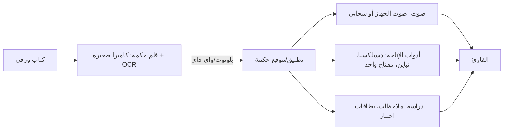

# رسم التصميم

```mermaid
flowchart LR
  Book[كتاب ورقي] --> Pen[قلم حكمة: كاميرا صغيرة + OCR]
  Pen -->|بلوتوث/واي فاي| App[تطبيق/موقع حكمة]
  App --> TTS[صوت: صوت الجهاز أو سحابي]
  App --> Access[أدوات الإتاحة: ديسلكسيا، تباين، مفتاح واحد]
  App --> Study[دراسة: ملاحظات، بطاقات، اختبار]
  TTS --> User[القارئ]
  Access --> User
  Study --> User
```
الموقع الحالي يحاكي القلم بإدخال نص أو مسح صفحة بالكاميرا.
